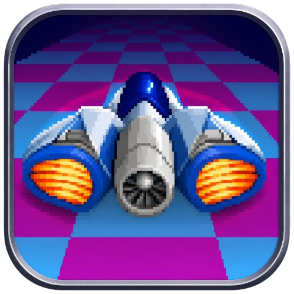

<p align="center">
  
</p>

# SkyRoads SDL

A native, cross-platform port of **SkyRoads** (Bluemoon Interactive, 1993) —
the classic DOS space racer — rewritten in portable C with SDL2. Runs
natively on macOS (Apple Silicon & Intel, universal binary), Linux and
Windows (x86_64 & ARM64). No emulation, no DOSBox.


[](https://github.com/pedrocatalao/skyroads-sdl/actions/workflows/macos.yml)
[](https://github.com/pedrocatalao/skyroads-sdl/actions/workflows/linux.yml)
[](https://github.com/pedrocatalao/skyroads-sdl/actions/workflows/windows.yml)

<p align="center">
  
  
</p>

## Download

- **[macOS](https://github.com/pedrocatalao/skyroads-sdl/releases/latest/download/skyroads-macos-universal.zip)** —
  universal app (Apple Silicon & Intel). Unzip, move `SkyRoads.app` anywhere
  you like, and **right-click → Open** the first time (the app isn't
  notarized, so macOS asks once).
- **Linux** —
  [x86_64](https://github.com/pedrocatalao/skyroads-sdl/releases/latest/download/skyroads-linux-x86_64.tar.gz) ·
  [ARM64](https://github.com/pedrocatalao/skyroads-sdl/releases/latest/download/skyroads-linux-arm64.tar.gz).
  `tar -xzf skyroads-linux-*.tar.gz && cd skyroads && ./skyroads` — no
  packages to install (SDL2 is bundled; built on Ubuntu 24.04, needs a
  comparably recent glibc).
- **Windows** —
  [x86_64](https://github.com/pedrocatalao/skyroads-sdl/releases/latest/download/skyroads-windows-x86_64.zip) ·
  [ARM64](https://github.com/pedrocatalao/skyroads-sdl/releases/latest/download/skyroads-windows-arm64.zip).
  Unzip and double-click `skyroads.exe` — SDL2 and the runtime DLLs are
  bundled, nothing to install.

All downloads are self-contained — the freeware game data is included.

## Build from source

### macOS

```bash
brew install cmake sdl2
git clone https://github.com/pedrocatalao/skyroads-sdl.git
cd skyroads-sdl
./make_mac.sh        # fetches the freeware game data, then builds the app
open build/SkyRoads.app
```

That's it. If the game data isn't in `./data` yet, `get_data.sh` fetches it
automatically from Bluemoon's official site (the game is their freeware and
is not part of this repo); `make_mac.sh` then builds a self-contained app
bundle around it.

Already have the game files? Point `make_mac.sh` at your folder —
DOS-style uppercase filenames (`ROADS.LZS`) are fine:

```bash
./make_mac.sh ~/Downloads/skyroads-data
```

The app is self-contained (game data is copied into the bundle) — you can move
it to `/Applications`. Progress and settings are saved to
`~/Library/Application Support/`.

### Alternative: run from the terminal

```bash
cmake -S . -B build
cmake --build build --target skyroads
./build/skyroads ~/Downloads/skyroads-data
```

### Linux

```bash
sudo apt install build-essential cmake libsdl2-dev curl unzip   # or your distro's equivalent
git clone https://github.com/pedrocatalao/skyroads-sdl.git
cd skyroads-sdl
./make_linux.sh      # fetches the freeware game data, then builds
./build/skyroads
```

Verified on Ubuntu (x86_64 and ARM64); prebuilt binaries for both are on the
[releases page](https://github.com/pedrocatalao/skyroads-sdl/releases/latest).

### Windows

Install [MSYS2](https://www.msys2.org), open the **MSYS2 UCRT64** shell
(or **CLANGARM64** on ARM machines) and:

```bash
pacman -S --needed git curl unzip mingw-w64-ucrt-x86_64-toolchain mingw-w64-ucrt-x86_64-cmake mingw-w64-ucrt-x86_64-ninja mingw-w64-ucrt-x86_64-SDL2
git clone https://github.com/pedrocatalao/skyroads-sdl.git
cd skyroads-sdl
./get_data.sh data
cmake -S . -B build -DCMAKE_BUILD_TYPE=Release
cmake --build build --target skyroads
./build/skyroads.exe
```

(On ARM, use the `mingw-w64-clang-aarch64-*` package names instead.)

## Controls

| Key | Action |
|---|---|
| ← → | steer |
| ↑ ↓ | accelerate / brake |
| Space | jump |
| Enter | select (menus) |
| P | pause / unpause |
| Esc | abort road / back |
| F9 | music synth: AdLib FM (OPL2) / wavetable ("AWE32"-style, sampled instruments) |
| F10 | CRT effects on/off (scanlines, phosphor trails, smooth scaling) |
| Cmd-F | fullscreen |

## What's in this repo

- `src/` — the port:
  - `render.c` — C rewrite of the original 16-bit assembly 3D road renderer
  - `game_play.c` — the physics/collision/gameplay engine (bit-faithful
    fixed-point math)
  - `assets.c`, `menus.c` — data loaders, menu flow
  - `compat.c` — DOS runtime emulation (segment memory model, LZSS
    decompressor, file I/O)
  - `platform.c` — SDL2 window/input/timing
  - `audio.c` — The original AdLib music driver (`adlib.asm`) ported to C:
    drives either a software OPL2 FM
    chip (Nuked-OPL3) or a
    SoundFont wavetable synth (TimGM6mb) mapped to MIDI instruments; plus the SoundBlaster digitized sound effects (`sfx.snd`)
- `docs/trek_blueprint.md` — reverse-engineering notes on the original
  renderer
- `make_mac.sh` — builds the signed `SkyRoads.app` bundle
- `make_linux.sh` — builds the `skyroads` binary on Linux
- `get_data.sh` — fetches the freeware game data + soundfont (shared by the
  build scripts, or run standalone)

## Roadmap

Ideas being considered — no promises, no dates. Opinions and requests
are welcome as [issues](https://github.com/pedrocatalao/skyroads-sdl/issues).

- **Online leaderboards** — per-road finish times, plus efficiency boards
  (least fuel / oxygen used)
- **More visual effects** — building on the CRT mode (scanlines and
  phosphor trails are in already)
- **Gamepad support**
- **High-resolution road rendering** — regenerating the renderer's
  perspective geometry at 2–4× (the original art stays pixel-perfect)
- **Demo/attract mode** — the original's recorded demo playback, not yet
  ported

## Troubleshooting

- **"required data file … not found"** — the path you gave `make_mac.sh` must
  contain the SkyRoads data files (`trekdat.lzs`, `roads.lzs`, `world*.lzs`,
  …). Point it at the folder where you unzipped the freeware download.
- **CMake can't find SDL2** — `brew install sdl2`, then delete
  `build/` and rebuild.
- **Intel Macs** — the app is a universal binary and runs natively on
  Intel too (x86_64 slice verified under Rosetta).

## Credits & legal

- **SkyRoads** was created by **Bluemoon Interactive** (Ahti Heinla,
  Jaan Tallinn, and team). All game content, art, music and the original
  design are theirs. This is an unofficial fan port, not affiliated with or
  endorsed by Bluemoon; the game itself is distributed by Bluemoon as
  freeware.
- Linux support contributions by Timár Csaba
  ([@xcom169](https://github.com/xcom169)).
- OPL2 FM synthesis via [Nuked-OPL3](https://github.com/nukeykt/Nuked-OPL3)
  (Nuke.YKT), LGPL-2.1 — see `src/opl3.c` for its license header.
- Wavetable music mode via [TinySoundFont](https://github.com/schellingb/TinySoundFont)
  (MIT) playing the [TimGM6mb](https://musescore.org) SoundFont (GPL,
  Tim Brechbill), fetched by `get_data.sh` — the instrument mapping was
  reconstructed from the original Sound Club song sources.
- Licensing is mixed by necessity — the original code is Bluemoon's and
  carries no open-source license; the port's own scripts and docs are MIT.
  Details in [LICENSE](LICENSE).
